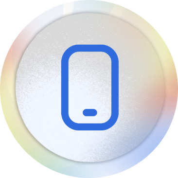

###

  
  
  
  
  
  
  

###

  
  
  

###

 

<h1 align="center">EventsJo</h1>

###

  

###

<h2 align="left">Project Architecture, Use Case Diagram and Screens</h2>

  

 

  

  

###

<h2 align="left">Introduction</h2>

###

EventsJo a cross-platform mobile app about booking various types of places.

###

<h2 align="left">Categories</h2>

###

The user can choose from:  • Wedding Venues. • Personal Event. • Farms. • Football Courts.

###

<h2 align="left">Technologies Used</h2>

EventsJo is developed using the framework Flutter with Dart as the programming language and with Bloc as a state management and Firebase as a the database.

###

